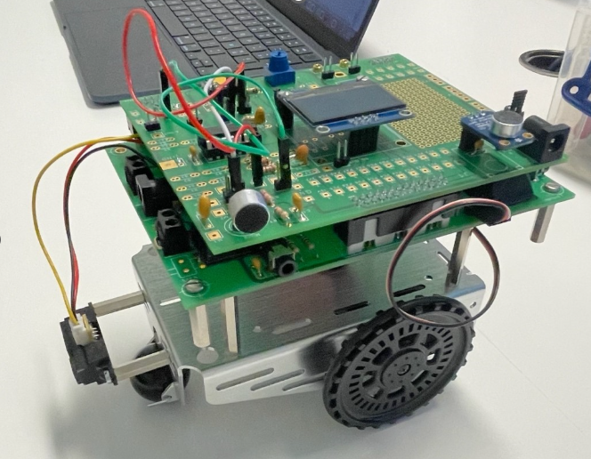

## Gnn_Chariot

##  Objectif du projet

Concevoir un **chariot mobile autonome** capable de :

* Démarrer automatiquement à la détection d’un **son spécifique (clé sonore)**.
* Se déplacer et **S’arrêter** automatiquement sur une distance d’environ **50 cm**.
* Afficher en temps réel ses **actions sur un écran OLED** et sur un **smartphone via Bluetooth**.
* Être **arrêté à distance via une commande Bluetooth**.
* Afficher, en option, **l’état de la batterie**.

---

##  Réalisation technique

### 1. Détection sonore

* Utilisation d’un **microphone électret** pour détecter une clé sonore.
* Câblage analogique validé avec le tuteur, puis soudé sur la carte.
* Numérisation du signal sonore via **ADC**, traitement du signal et génération de fichiers texte pour analyse.

### 2. Déplacement du chariot

* Fixation de la carte sur le châssis mobile.
* Intégration d’un **capteur de distance (Sharp)** pour suivre une paroi.
* Contrôle des moteurs par **PWM** (broches PB4/PB5) avec la carte TM4C123.
* Limitation du déplacement à **50 cm**, arrêt conditionné par la distance.

### 3. Affichage OLED

* Afficheur OLED connecté en **I2C (port 2)**.
* Affichage de l’état du chariot :

  * En attente de son
  * Démarrage
  * En mouvement
  * Distance parcourue / Arrêt
  * Arrêt Bluetooth

### 4. Communication Bluetooth

* Module Bluetooth configuré en UART.
* Affichage des états du chariot sur **application mobile**.
* Réception de commandes pour un **arrêt manuel à tout moment**.

### 5. État de la batterie *(optionnel)*

* Affichage de la tension mesurée via **diviseur résistif** connecté à un canal ADC.
* Interprétation graphique ou textuelle du niveau de charge.

---

##  Technologies & Matériel utilisés

* Microcontrôleur : **TM4C123GH6PM (Tiva C LaunchPad)**
* Capteurs :

  * **Microphone électret**
  * **Sharp IR (GP2Y0A21)**
* Communication : **Module Bluetooth HC-05/06**
* Affichage : **Écran OLED I2C (SSD1306)**
* Environnement de développement : **Energia**, langage **C**

---

##  Démonstration et commandes

* **Clé sonore détectée** → le chariot démarre.
* **Message OLED/Bluetooth :** `Clé détectée – Démarrage`
* **distance > 50 cm** → arrêt.
* **Commande Bluetooth :** `STOP` → arrêt immédiat.
* **Affichage batterie :** `Batterie : 3.7V`

---

##  Tests réalisés

* ✔️ Détection fiable de fréquence sonore cible
* ✔️ Suivi stable d’une paroi
* ✔️ Affichage synchrone sur OLED et smartphone
* ✔️ Commande distante fonctionnelle via Bluetooth
* ✔️ Affichage et interprétation de la batterie (*si intégré*)

---

## resultat final et démonstration 

  

 [Télécharger la vidéo de démonstration](Demo.mp4)

---
